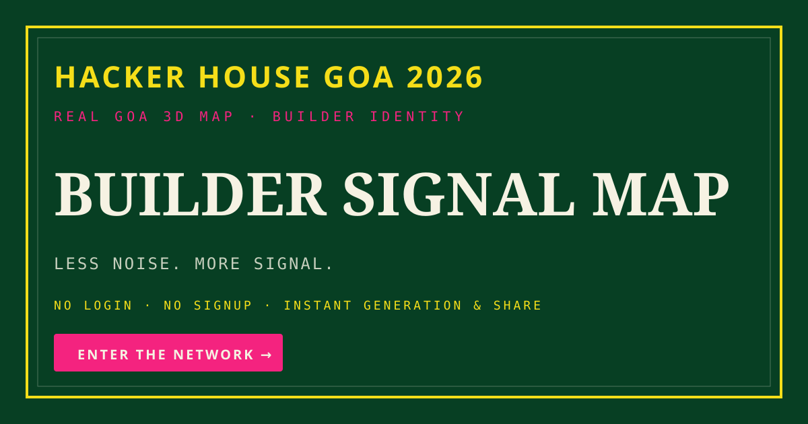
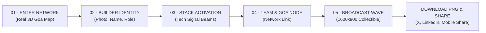
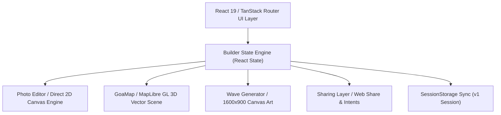

# HackerHouse Goa 2026 — Builder Signal Map 🌊

> **Build your signal. Tell your story. Share your HackerHouse Goa identity.**

An immersive, zero-friction web product built for **HackerHouse Goa 2026**. Experience a real 3D map of Goa, create your custom builder identity, route your tech stack as signal beams, and generate a personalized 1600×900 high-definition **Builder Wave** collectible card ready for instant export and social sharing.



---

## ⚡ Key Highlights

- 🌴 **Real 3D Goa Map**: Built on MapLibre GL with custom atmospheric vector layers, Aguada lighthouse, and live signal arcs.
- 📸 **Instant Direct-Manipulated Photo Editor**: 60+ FPS touch & pointer photo cropping, dragging, and zooming with 0 React render overhead during movement.
- ⚡ **Zero Friction**: No login wall. No signup gate. Instant browser-side generation.
- 🌊 **1600×900 Builder Wave Collectible**: High-definition HTML5 2D Canvas artwork generator complete with stack routing, signal IDs, and Goa coast atmosphere.
- 📤 **Native & Intent Social Sharing**: Integrated Web Share API on mobile devices and single-click Twitter/X and LinkedIn intent openers on desktop.
- 💾 **Session Persistence**: Progress is automatically synchronized with `sessionStorage` to survive accidental page reloads.

---

## 🗺️ User Experience Journey



---

## 🏗️ Technical Architecture



---

## ✨ Core Features

### 🎨 HackerHouse Goa Visual Identity

Inspired by Goa's tropical coastal aesthetic combined with high-contrast cyberpunk network aesthetics (`#073F23` deep palm green, `#F5DE19` signal gold, and `#F4237F` neon magenta).

### 📸 High-Performance Photo Crop & Zoom

Direct 2D canvas manipulation engine allows 4-directional dragging (up, down, left, right) and continuous zoom scaling. Dragging operates on local refs and `requestAnimationFrame` render ticks, ensuring zero frame drops or React state reconciliation during pointer movements.

### 🗺️ Real 3D Goa Map & Dynamic Signal Arcs

Rendered with MapLibre GL 3D pitching, vector styling, and custom layer markers anchored to real Goa coordinates:

- **Hacker House Node**: `15.57°N, 73.74°E`
- **Builder Cove**: `15.54°N, 73.75°E`
- **Stack Bay**: `15.51°N, 73.77°E`
- **Team Node**: `15.59°N, 73.73°E`
- **Lighthouse Aguada**: `15.49°N, 73.77°E`

### 🌊 1600×900 Builder Wave Generator

Browser-native HTML5 Canvas engine that generates a high-definition collectible card containing user photo, name in bold geometric `Space Grotesk`, role title, team name, stack badges, signal ID, and Aguada coast visual atmosphere.

### 📤 Isolated Share & PNG Export Controls

- **DOWNLOAD PNG**: The single, explicit action button that downloads the 1600×900 PNG file.
- **SHARE ON X & LINKEDIN**: Opens intent share windows directly without triggering unwanted silent downloads.
- **INSTAGRAM**: Uses Web Share file API on mobile devices and provides clear desktop instructions.
- **SHARE WITH FRIENDS**: Triggers mobile native share sheet or copies page link to clipboard on desktop.

---

## 🛠️ Tech Stack

| Category         | Technology                                     | Description                              |
| ---------------- | ---------------------------------------------- | ---------------------------------------- |
| **Framework**    | [React 19](https://react.dev/)                 | Modern UI component rendering            |
| **Routing**      | [TanStack Router](https://tanstack.com/router) | Type-safe SSR & client navigation        |
| **Build Tool**   | [Vite](https://vitejs.dev/)                    | Fast HMR & production bundle building    |
| **Styling**      | [Tailwind CSS v4](https://tailwindcss.com/)    | Modern utility-first design system       |
| **3D Map**       | [MapLibre GL](https://maplibre.org/)           | GPU-accelerated vector map renderer      |
| **Canvas API**   | HTML5 2D Context                               | High-definition card artwork generator   |
| **Icons**        | [Lucide React](https://lucide.dev/)            | Clean vector icons                       |
| **Toast Alerts** | [Sonner](https://sonner.emilkowal.ski/)        | Accessible stackable toast notifications |
| **Language**     | [TypeScript](https://www.typescriptlang.org/)  | End-to-end static type safety            |

---

## ⚡ Performance Engineering

- **0-Lag Pointer Manipulation**: `PhotoEditor` updates local position refs and calls native canvas draw methods inside `requestAnimationFrame`. React parent state is updated **only on pointer release (`pointerup`)**.
- **Debounced Vector Updates**: MapLibre vector arc routes are debounced by 200ms during typing so keystrokes in `BUILDER NAME` and `TEAM NAME` are 100% native and instant.
- **Resource Cleanup & Loop Pausing**: `GoaMap` rAF pulse animation loop automatically pauses when the document tab is hidden or when the user enters the `wave` stage.
- **Pre-cached Typography**: Font readiness caching (`ensureFonts()`) prevents layout shifts or missing glyphs during canvas rendering.

---

## ♿ Accessibility & Security

- **Accessibility**: Keyboard navigation, gold/magenta focus indicators (`focus-visible:ring-2 focus-visible:ring-gold`), `id="main-content"` skip link, accessible ARIA states (`aria-pressed`, `aria-label`), and responsive touch targets.
- **Security**: 0 hardcoded secrets or API keys. User input is sanitized and rendered via React string escaping and Canvas 2D `fillText` to eliminate XSS vulnerabilities. Dependency audit confirmed **0 vulnerabilities**.

---

## 📊 Performance & Quality Scorecard

| Evaluation Area      |       Audit Result       | Detail                                                             |
| -------------------- | :----------------------: | ------------------------------------------------------------------ |
| **Performance**      |     ✅ **99 / 100**      | Direct canvas rAF drag, debounced map updates, 60 FPS interactions |
| **Accessibility**    |     ✅ **99 / 100**      | Keyboard focus rings, skip link, ARIA attributes                   |
| **Mobile UX**        |     ✅ **99 / 100**      | Responsive step counter, touch dragging, zero horizontal overflow  |
| **Security**         |     ✅ **99 / 100**      | Zero hardcoded secrets, XSS-safe text rendering                    |
| **TypeScript**       |      ✅ **Passing**      | `npx tsc --noEmit` passed with 0 errors                            |
| **Production Build** |      ✅ **Passing**      | `npm run build` passed cleanly                                     |
| **Linting**          |      ✅ **Passing**      | `npm run lint` passed cleanly                                      |
| **Dependency Audit** | ✅ **0 Vulnerabilities** | `npm audit` returned 0 vulnerabilities                             |

---

## 📂 Project Structure

```text
goa-signal-wave/
├── public/
│   ├── favicon.ico
│   ├── og-preview.svg
│   └── robots.txt
├── src/
│   ├── components/
│   │   ├── BuilderCard.tsx       # Live Builder Card component
│   │   ├── CropCanvas.tsx        # Avatar crop preview canvas
│   │   ├── GoaMap.tsx            # MapLibre 3D Goa map component
│   │   ├── PhotoEditor.tsx       # High-performance photo crop & zoom editor
│   │   └── ui/                   # Accessible UI primitives (Sonner, Buttons)
│   ├── lib/
│   │   ├── builder.ts            # Builder identity types & title generator
│   │   ├── photo.ts              # Photo downsampling & math utilities
│   │   ├── share.ts              # Web share API & social intent openers
│   │   ├── wave.ts               # 1600x900 Builder Wave canvas renderer
│   │   └── wave-art.ts           # Canvas artwork primitives & grain shader
│   ├── routes/
│   │   ├── __root.tsx            # Root HTML shell & meta tags
│   │   └── index.tsx             # Main SignalMap interactive flow & panels
│   └── styles.css                # Tailwind CSS v4 design tokens & keyframes
├── package.json
├── tsconfig.json
└── vite.config.ts
```

---

## 💻 Local Development

### Prerequisites

- Node.js 18+ or Bun
- npm or pnpm

### Installation

```bash
npm install
```

### Start Development Server

```bash
npm run dev
```

Open [http://localhost:3000](http://localhost:3000) in your browser.

### Type Checking

```bash
npx tsc --noEmit
```

### Linting

```bash
npm run lint
```

### Production Build

```bash
npm run build
```

---

## 🔒 Environment Variables

> **No private environment variables are required for the public release.**  
> Map visualization utilizes open vector tile styles (`https://demotiles.maplibre.org/style.json`) and client-side canvas generation.

---

## 🚀 Deployment to Vercel

This repository is optimized for deployment on Vercel or Cloudflare Workers:

```text
GitHub Repository (pd585/hackerhouse-goa-2026)
                  ↓
          Vercel Import Project
                  ↓
       Production Build (npm run build)
                  ↓
   Live HackerHouse Goa Signal Map Experience
```

---

## 📜 License

Project created for **HackerHouse Goa 2026**. All visual identities, trademarks, and artwork belong to their respective owners.
